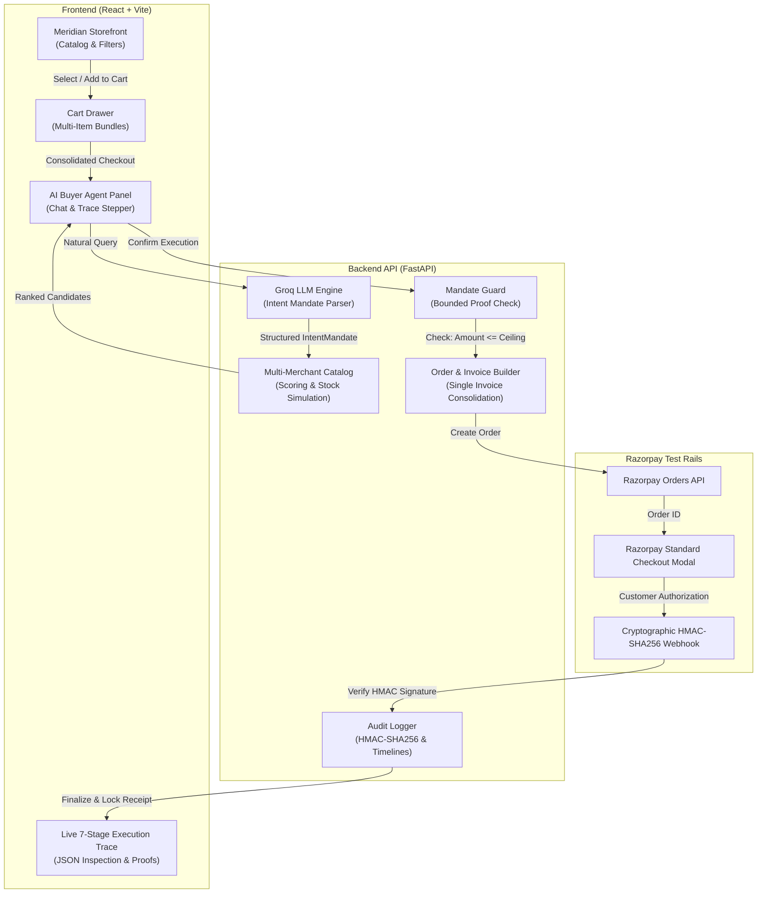

<div align="center">

# 🌐 Meridian
### *Autonomous AI Buyer with Bounded Mandates & Cryptographic Payment Verification*

**Razorpay AI Buildathon — Track 01 (Autonomous Agentic Commerce)**

[](https://razorpay-buildathon-sid.onrender.com)
[](https://razorpay-buildathon-sid-1.onrender.com/docs)
[](https://razorpay.com)
[](https://groq.com)

<br/>

[**🌐 Live Application**](https://razorpay-buildathon-sid.onrender.com) • [**⚡ API Documentation**](https://razorpay-buildathon-sid-1.onrender.com/docs) • [**📖 Deployment Guide**](./RENDER_DEPLOYMENT.md)

</div>

---

## 📌 Executive Summary

As autonomous AI agents evolve from conversational assistants into transaction engines, a critical safety gap emerges: **How do we authorize AI agents to discover, negotiate, and purchase items across multiple merchants without risking unbounded spending, hallucinations, or untrusted payments?**

**Meridian** solves this with an end-to-end **Bounded Agentic Commerce Platform**:
1. **Natural Language Intent Parsing**: Powered by Groq LLM to convert unstructured user queries (*"smartwatch under ₹3000 by tomorrow"*, *"running shoes, size 9"*) into machine-readable intent mandates with budget, size, and ETA bounds.
2. **Explainable Candidate Evaluation**: Scored across multi-merchant catalogs with visible reasoning for why candidates were selected or rejected.
3. **Bounded Mandate Defense**: Cryptographically verifies `Amount <= Budget Ceiling` before generating single-use authorization tokens. If bounds are breached, execution safely halts with **₹0 charged**.
4. **Single Consolidated Cart Checkout**: Bundles multiple items across merchants into a single unified Razorpay order and tax invoice.
5. **Live 7-Stage Execution Trace**: Real-time interactive stepper visualizing every stage of agent execution with expandable structured JSON payloads, cryptographic HMAC-SHA256 signature verification, and official downloadable tax invoices.

---

## 🔗 Live Deployments

| Component | Platform | URL |
|---|---|---|
| **Frontend Web App** | Render Static Site | [https://razorpay-buildathon-sid.onrender.com](https://razorpay-buildathon-sid.onrender.com) |
| **Backend REST API & Swagger** | Render Web Service | [https://razorpay-buildathon-sid-1.onrender.com/docs](https://razorpay-buildathon-sid-1.onrender.com/docs) |

---

## 🌟 Key Features

### 🛍️ 1. Split-Pane Storefront & AI Buyer Experience
- **Left Pane (~65%)**: Modern e-commerce storefront with multi-category browsing (*Running, Sneakers, Audio, Watches, Bags*), price filters, stock simulations, ratings, and instant *"Add to Cart"* or *"Buy with AI"*.
- **Right Pane (~35%)**: Persistent AI Buyer chat panel featuring conversational assistance, natural intent extraction, explainability reasoning cards, and two clear checkout pathways:
  - **`[Add to Cart]`**: Stashes items for multi-product cart bundles.
  - **`[Proceed to Pay]`**: Immediately dispatches the agent mandate for single-invoice checkout.

### 🧠 2. LLM Intent Parser (Groq-Powered)
- Zero-assumption parser: Extracts category, explicit budget ceilings (understands `2500`, `3k`, `₹3,000`), size specifications, and delivery deadlines.
- Does **not** invent or assume budgets when none are specified.
- Resilient fallback mechanism ensures seamless operation even during network degradation.

### 🛡️ 3. Bounded Mandate Security & Safety Abort
- **Strict Ceiling Enforcement**: Authorization tokens are bounded to user-approved parameters.
- **Ceiling Breach Defense**: Live demonstration triggers safe halts when prices exceed authorized ceilings (₹0 charged).
- **Tamper Rejection**: Simulates HMAC-SHA256 signature mismatches to prevent man-in-the-middle webhook attacks.
- **Stockout Auto-Recovery**: Mid-flow stockout detection with instant graceful fallback to Rank #2 candidates within mandate bounds.

### 🛒 4. Multi-Item Cart & Single Consolidated Invoice
- Persistent slide-over cart drawer with live quantity adjustments and subtotal/tax calculations.
- **Single-Invoice Mandate Checkout**: Consolidates multiple items from different merchants into **1 Razorpay Order** and **1 Single Tax Invoice**.

### 🧾 5. Official Tax Invoice & Orders History
- **Printable & JSON Export**: Generate official Meridian tax invoices with merchant details, line items, and cryptographic signature stamps.
- **Orders Modal**: Persistent order history tracking all past verified purchases.

---

## 🏗️ System Architecture



---

## ⚡ The 7-Stage Execution Pipeline

Meridian renders a real-time, step-by-step cryptographic stepper during every purchase:

| Stage | Name | Description | Verification / Payload |
|---|---|---|---|
| **1** | **Intent Parsed** | Extracts intent, category, budget ceiling, size, and ETA constraints via Groq LLM. | Machine-readable IntentMandate JSON |
| **2** | **Candidates Scored** | Discovers merchant inventory and evaluates candidates on price, rating, and stock. | Ranked candidates list & explainability score |
| **3** | **Mandate Authorized** | Proves `Amount <= Budget Ceiling`. Halts with Safe Abort if breached. | `Bounded Proof: ₹Price <= ₹Ceiling` |
| **4** | **Order Created** | Generates consolidated merchant order and itemized line items. | Single Invoice Order Payload |
| **5** | **Payment Initiated** | Dispatches Razorpay Orders API and launches reactive Checkout modal. | Razorpay Order ID & checkout trigger |
| **6** | **Webhook Verified** | Cryptographically verifies server-side HMAC-SHA256 signature payload. | `HMAC-SHA256 Signature: PASS` |
| **7** | **Confirmed** | Seals cryptographic audit log and generates official downloadable Tax Invoice. | Receipt ID (`RCP_XXXXXX`) & Locked Audit |

---

## 💻 Tech Stack

### Frontend
- **Framework**: React 18 + Vite
- **Styling**: Modern Vanilla CSS Design System (Stripe/Fintech Dark/Light Glassmorphism)
- **Icons**: Lucide React
- **Payments SDK**: Razorpay Standard Checkout (`checkout.razorpay.com/v1/checkout.js`)
- **Typography**: Outfit, Satoshi, Inter, JetBrains Mono

### Backend
- **Framework**: FastAPI (Python 3.11)
- **Server**: Uvicorn (ASGI)
- **LLM Engine**: Groq Cloud SDK (`openai/gpt-oss-120b` / `llama-3.3-70b-versatile`)
- **Database / ORM**: SQLite / SQLAlchemy
- **Data Validation**: Pydantic v2
- **Payments Integration**: Razorpay Python SDK

---

## 🚀 Local Development Setup

### Prerequisites
- Node.js (v18+) & npm
- Python (v3.10+)

### 1. Clone the Repository
```bash
git clone https://github.com/aswath-siddharth/Razorpay-Buildathon-SID-.git
cd Razorpay-Buildathon-SID-
```

### 2. Backend Setup
```bash
cd backend
python -m venv venv
# Windows:
venv\Scripts\activate
# Linux/macOS:
# source venv/bin/activate

pip install -r requirements.txt
```

Create `backend/.env`:
```env
RAZORPAY_KEY_ID=rzp_test_TTbqDaKP2i6PmQ
RAZORPAY_KEY_SECRET=your_razorpay_secret
RAZORPAY_WEBHOOK_SECRET=your_webhook_secret
GROQ_API_KEY=your_groq_api_key
```

Run the backend server:
```bash
uvicorn app.main:app --reload --port 8000
```
Swagger UI will be available at `http://localhost:8000/docs`.

### 3. Frontend Setup
```bash
cd ../frontend
npm install
npm run dev
```
Open `http://localhost:5173` in your browser.

---

## 🧪 Test Scenarios & Judge Demo Queries

Try these queries in the AI Buyer Agent panel:

| Scenario | Input Query | Expected Behavior |
|---|---|---|
| **Happy Path Purchase** | `"running shoes under ₹3000, size 9, arrive by Friday"` | Evaluates shoes, ranks lowest price winner, authorizes mandate, and opens Razorpay Checkout modal. |
| **Open Ceiling Search** | `"I need shoes"` | Explores sneakers without assuming an arbitrary budget limit, ranking top candidates by value. |
| **Smartwatch Discovery** | `"smartwatch under ₹3000 by tomorrow"` | Finds matching AMOLED/GPS smartwatches arriving tomorrow. |
| **Mandate Breach Abort** | `"smartwatch under 1k by tomorrow"` | Detects price exceeds ₹1,000 ceiling. Triggers **Safe Abort** (₹0 charged). |
| **Cryptographic Webhook** | Click *"Webhook Tamper"* demo | Demonstrates rejection of invalid HMAC-SHA256 signatures (Status 400). |
| **Stockout Recovery** | Click *"Stockout Fallback"* demo | Simulates mid-flow stockout on Rank #1 and recovers to Rank #2. |
| **Consolidated Cart** | Add 2+ items to Cart -> Click *"Checkout Whole Cart with AI Mandate"* | Bundles all items into **1 Single Tax Invoice** and single Razorpay payment. |

---

## 🔒 Security & Mandate Guarantees

1. **Pre-Authorized Budget Bounds**: The AI agent cannot charge beyond the exact ceiling authorized in the intent mandate.
2. **Zero-Spend Mitigation**: If any parameter fails (inventory, price breach, user cancellation), the transaction aborts with ₹0 funds touched.
3. **Cryptographic Webhook Verification**: All fulfillment relies on server-validated HMAC-SHA256 signatures, preventing spoofing.
4. **Immutable Audit Trail**: Every decision, score, and state transition is sealed with timestamps and raw payload inspection.

---

## 📄 License
This project is licensed under the MIT License - see the [LICENSE](./LICENSE) file for details.

---

<div align="center">
Built with ❤️ for the <strong>Razorpay AI Buildathon</strong>
</div>
